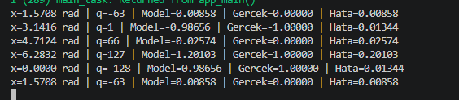

# 002 — INT8 Cosine Regression on ESP32

A small neural network approximates `y = cos(x)` on a classic ESP32 using native ESP-IDF and TensorFlow Lite Micro. This is a learning experiment covering model conversion, INT8 input/output handling, deployment, and comparison with an analytic reference.

The model was built, flashed, and run on an ESP32. Five serial-monitor predictions were recorded on **2026-10-05**. Inference latency and full test-set accuracy have not been measured for this device experiment.

## Environment

| Item | Value |
|---|---|
| Target | Classic ESP32 / Xtensa |
| Framework | ESP-IDF 6.1.0 |
| Configured CPU frequency | 160 MHz |
| Configured flash size | 2 MB |
| Runtime | `espressif/esp-tflite-micro` 1.4.1 |
| Kernel dependency | `espressif/esp-nn` 1.4.1 |
| Input | One INT8 value representing an angle in radians |
| Output | One INT8 cosine prediction |
| Model file size | 3,344 bytes, including graph and metadata |
| Reserved tensor arena | 16,384 bytes |
| Arena usage observed during startup diagnostics | 972 bytes |
| Inference task stack allocation | 8,192 bytes |

Arena usage is the amount used inside the reserved array. It is separate from the task stack and other ESP-IDF RAM allocations. The final demo prints predictions; the arena measurement comes from the preceding startup diagnostic build with the same model and allocation code.

## Model and training

| Layer | Input size | Output size | Activation |
|---|---:|---:|---|
| Dense | 1 | 16 | ReLU |
| Dense | 16 | 16 | ReLU |
| Dense | 16 | 1 | Linear |

The supplied [training notebook](notebooks/02_cosinus_training.ipynb) generates 2,000 samples over `[0, 2π]`, adds Gaussian noise with standard deviation 0.05 to the cosine targets, and uses a 60/20/20 train/validation/test split. Training uses 250 epochs and a batch size of 32. The first 100 training inputs form the calibration set for fully integer conversion.

The notebook is archived as supplied. NumPy has a fixed seed; TensorFlow weight initialization is not explicitly seeded, so rerunning training can produce different weights. The shipped `.tflite` file was extracted byte-for-byte from the uploaded ESP32 `model_data.h`. Its SHA-256 is recorded in [model metadata](docs/model_metadata.json).

## INT8 data handling

| Tensor | Scale | Zero point |
|---|---:|---:|
| Input | 0.024316836148500443 | -128 |
| Output | 0.008578787557780743 | -13 |

The firmware reads these parameters from the model at runtime:

```text
q_input = clamp(round(x / input_scale) + input_zero_point, -128, 127)
y = (q_output - output_zero_point) * output_scale
```

`interpreter.Invoke()` produces the neural-network prediction. `cosf(x)` computes the comparison value after inference. Only `FULLY_CONNECTED` needs to be registered: the two ReLU activations are fused into the Dense operations.

## Recorded ESP32 results

Angles and values below retain the serial monitor's displayed precision.

| x (radians) | INT8 input | Model | Analytic cosine | Absolute error |
|---:|---:|---:|---:|---:|
| 0.0000 | -128 | 0.98656 | 1.00000 | 0.01344 |
| 1.5708 | -63 | 0.00858 | 0.00000 | 0.00858 |
| 3.1416 | 1 | -0.98656 | -1.00000 | 0.01344 |
| 4.7124 | 66 | -0.02574 | 0.00000 | 0.02574 |
| 6.2832 | 127 | 1.20103 | 1.00000 | 0.20103 |



The final point has a larger error. The model's input quantization can represent at most approximately **6.200793 radians**, whereas `2π` is approximately 6.283185 radians. The requested endpoint rounds to `q=130` and is clamped to `q=127`. This introduces an input mismatch; model approximation error also contributes to the output error. The linear output layer does not constrain predictions to `[-1, 1]`.

These five points establish that the deployment and INT8 inference pipeline works. They are not a full accuracy evaluation. The supplied notebook's training/test outputs use noisy targets and should not be treated as ESP32 measurements on the analytic cosine.

## Build and run

Open this project folder, `002-cosine-regression-esp32`, in VS Code with the ESP-IDF extension. Select an ESP-IDF 6.1.0 environment and your device's serial port.

From an activated ESP-IDF terminal in this folder:

```bash
idf.py reconfigure
idf.py build
idf.py -p COM4 flash monitor
```

`COM4` was used for the recorded run; select the port assigned to your own device. The initial configuration downloads managed dependencies, and the first build compiles the runtime. Subsequent builds can reuse unchanged object files. Exit an existing monitor before flashing.

The demo prints one prediction per second and repeats the same five angles. The saved `sdkconfig` preserves the working board configuration; `sdkconfig.defaults` also records the main settings for a fresh configuration. `dependencies.lock` preserves the observed runtime dependency versions.

## Files

| Path | Purpose |
|---|---|
| `main/main.cpp` | Model initialization and the five-angle inference loop |
| `main/model_data.h` | Embedded INT8 model, aligned to 16 bytes |
| `main/idf_component.yml` | TensorFlow Lite Micro dependency declaration |
| `models/cosinus_int8.tflite` | Exact binary model extracted from the header |
| `notebooks/02_cosinus_training.ipynb` | Original training and conversion notebook |
| `docs/device_results.csv` | Five measured device predictions |
| `docs/device_output.txt` | Transcription of the supplied monitor screenshots |
| `docs/esp32_startup.png` | Startup diagnostics screenshot |
| `docs/esp32_inference.png` | Prediction screenshot |
| `docs/model_metadata.json` | Model shapes, quantization, operators, and checksum |
| `docs/reference_check.json` | Independent five-point LiteRT reference comparison |

Before archiving, source indentation was normalized and a redundant outer infinite loop was removed. The model bytes, quantization formulas, test angles, and one-second interval were preserved. The supplied source had already run on the device; the formatted archive was not flashed again.

## Verification and next experiments

An independent host check using LiteRT 2.2.0 reference kernels reproduced all five displayed ESP32 predictions after rounding to five decimal places. The host check verifies the model and data path; it is not an ESP32 timing benchmark.

Next experiments are to measure `Invoke()` latency, evaluate a dense input grid, and test calibration samples that cover both interval endpoints. The boundary error is retained in the recorded results.

## References

- [Espressif TensorFlow Lite Micro component](https://components.espressif.com/components/espressif/esp-tflite-micro/versions/1.4.1/readme)
- [LiteRT INT8 quantization specification](https://developers.google.com/edge/litert/conversion/tensorflow/quantization/quantization_spec)
- [ESP-IDF Component Manager](https://docs.espressif.com/projects/esp-idf/en/latest/esp32/api-guides/tools/idf-component-manager.html)
